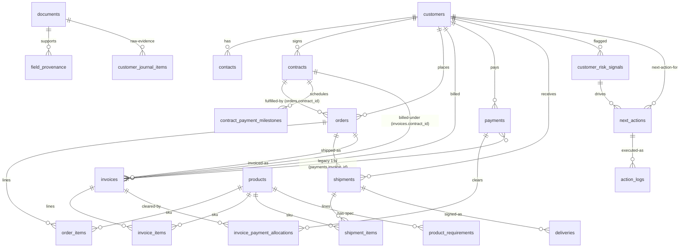

# 客户经营本体 (Customer Operations Ontology) — P0

The data backbone behind 智通客户 / 超级小陈. Defines the 12 core business
entities (customer, contact, contract, order, order_item, product,
shipment, delivery, invoice, payment, risk, next_action), the
cross-cutting fields every row carries, the relationships that bind
them, and where each lives in the codebase.

This document is the contract. If you add a new ontology column or
table, update this file in the same commit.

---

## 1. Architecture summary

* **Isolation**: per-enterprise Postgres database (one DB per tenant,
  named `tenant_<enterprise_id>`). No row-level `tenant_id` column,
  no Postgres RLS — the DB boundary is the security boundary. See
  `yunwei_win/db.py::_build_tenant_url`.
* **Schema source of truth**: SQLAlchemy 2.0 typed models under
  `services/platform-api/yunwei_win/models/`. A new tenant DB is
  provisioned via `Base.metadata.create_all`; existing tenant DBs
  receive idempotent `ALTER TABLE` patches from
  `_run_lightweight_tenant_migrations` on cold start.
* **Centralised enums**: import every business enum from
  `yunwei_win.enums` (single re-export point). Add the enum next to
  its model + re-export from `enums.py`.
* **Provenance**:
  - **Field-level**: `field_provenance` (existing) — one row per
    extracted field with document / page / excerpt / model confidence.
  - **Row-level**: `RowProvenanceMixin` columns (`source_type`,
    `source_ref`, `source_span`, `confidence`, `extracted_by`) on
    every ontology row, so list views can render the "where did this
    come from" badge without joining.
* **Money / time / nullability conventions**:
  - amounts are `NUMERIC(18, 4)` (`NUMERIC(15, 2)` on legacy `orders`
    is kept for backward compat).
  - timestamps are `TIMESTAMP WITH TIME ZONE` (`DateTime(timezone=True)`).
  - dates without time are `DATE`.
  - every new column added by this ontology is nullable or
    `DEFAULT`-ed so existing inserts / migrations keep working.

---

## 2. Cross-cutting mixins

Defined in `yunwei_win/models/_mixins.py`. Every core business entity
composes:

| Mixin | Columns | Purpose |
| --- | --- | --- |
| `RowProvenanceMixin` | `source_type` `VARCHAR(32)`, `source_ref` `VARCHAR(255)`, `source_span` `JSON`, `confidence` `NUMERIC(3,2)`, `extracted_by` `VARCHAR(64)` | "Where did this row come from?" Coarse type + opaque ref + structured pointer + row-creation confidence + extractor name (model / worker / user). |
| `HumanVerificationMixin` | `human_verified` `BOOLEAN NOT NULL DEFAULT FALSE`, `verified_by` `VARCHAR(128)`, `verified_at` `TIMESTAMPTZ` | "Has a human looked at this and confirmed?" Manual entry flips to `true` on insert; AI-proposed rows stay `false` until the inbox-review UI clears them. |
| `RowAuditMixin` | `created_by` `VARCHAR(128)`, `updated_by` `VARCHAR(128)` | Actor identifiers. Pairs with `TimestampMixin`'s `created_at` / `updated_at`. |
| `OwnershipMixin` | `owner_user_id` `VARCHAR(128)`, `team_id` `VARCHAR(128)` | Per-row sales ownership. **Only the schema is laid down here** — the row-filter logic (sales sees their own rows, lead sees the team's, owner sees all) is intentionally not enforced and will be wired in a follow-up task. |
| `SoftDeleteMixin` | `is_deleted` `BOOLEAN NOT NULL DEFAULT FALSE INDEX` | "Removed by user" — never physically deleted; list views filter `is_deleted = false`. |

`CustomerRiskSignal` already has a `confidence` column, so it omits
`RowProvenanceMixin` and gains the other four mixins directly.

`TimestampMixin` (existing) supplies `created_at` / `updated_at`.

---

## 3. Entity-relationship diagram



> The diagram covers the 12 ontology entities + their immediate
> neighbours. Memory-layer tables (events / commitments / memory_items /
> inbox_items) and the schema-catalog / extraction tables are documented
> in their respective modules and intentionally omitted here for
> readability.

---

## 4. Entity reference

### 4.1 Customer (`customers`)
File: `yunwei_win/models/customer.py`.

| Column | Type | Notes |
| --- | --- | --- |
| `id` | `UUID PK` | |
| `full_name` | `VARCHAR NOT NULL INDEX` | 客户全名 |
| `short_name` | `VARCHAR NULL` | 简称 |
| `tax_id` | `VARCHAR NULL` | 统一社会信用代码 |
| `industry` | `VARCHAR NULL` | 行业 |
| `address` | `VARCHAR NULL` | 所在地 |
| `notes` | `TEXT NULL` | 备注 |
| `created_at` / `updated_at` | `TIMESTAMPTZ NOT NULL` | from `TimestampMixin` |
| + `RowProvenanceMixin` columns | | source_type, source_ref, source_span, confidence, extracted_by |
| + `HumanVerificationMixin` columns | | human_verified, verified_by, verified_at |
| + `RowAuditMixin` columns | | created_by, updated_by |
| + `OwnershipMixin` columns | | owner_user_id (所属销售), team_id |
| + `SoftDeleteMixin` columns | | is_deleted |

**Missing-from-prompt mapping**:
- 规模 / 来源 / 状态 are not first-class columns yet — captured in
  `notes` or `customer_memory_items`. Promote to typed columns in a
  follow-up if the UI needs them indexed.

### 4.2 Contact (`contacts`)
File: `yunwei_win/models/contact.py`. Enum: `ContactRole`.

Existing columns: `id`, `customer_id` FK, `name`, `title`, `phone`,
`mobile`, `email`, `role`, `address`, `wechat_id`, `needs_review`.

**Added by P0**: `is_key_decision_maker` `BOOLEAN NOT NULL DEFAULT FALSE`
+ full ontology mixin set.

### 4.3 Contract (`contracts`)
File: `yunwei_win/models/contract.py`.

Existing columns: `id`, `customer_id` FK (nullable), `order_id` FK
(legacy, nullable), `contract_no_external`, `contract_no_internal`,
`amount_total`, `amount_currency`, `payment_milestones` (legacy JSON),
`delivery_terms`, `penalty_terms`, `effective_date`, `expiry_date`,
`signing_date`, `confidence_overall`.

**Added by P0**: `payment_terms` `TEXT` (账期 free text), `status`
`VARCHAR(32)`, full ontology mixin set. `confidence_overall` (document
level) and `RowProvenanceMixin.confidence` (row-creation seed) coexist.

> Relationship direction note: legacy `contracts.order_id` (contract
> belongs to order) is kept for backward compat. The canonical
> ontology direction is `orders.contract_id` (order fulfils contract),
> matching "Contract 1—* Order".

### 4.4 Order (`orders`)
File: `yunwei_win/models/order.py`.

| Column | Type | Notes |
| --- | --- | --- |
| `id` | `UUID PK` | |
| `customer_id` | `UUID NOT NULL FK→customers` `INDEX` | |
| `order_no` | `VARCHAR(128) NULL INDEX` | **new** |
| `contract_id` | `UUID NULL FK→contracts` `INDEX` | **new** — canonical contract pointer |
| `order_date` | `DATE NULL` | **new** — 下单日期 |
| `amount_total` | `NUMERIC(15, 2) NULL` | legacy precision kept |
| `amount_currency` | `VARCHAR(8) NOT NULL DEFAULT 'CNY'` | |
| `delivery_promised_date` | `DATE NULL` | 交期 |
| `delivery_address` | `TEXT NULL` | |
| `description` | `TEXT NULL` | |
| `status` | `VARCHAR(32) NULL` | **new** |
| + ontology mixin columns | | full set |

### 4.5 OrderItem (`order_items`) — **NEW**
File: `yunwei_win/models/operations.py`.

| Column | Type | Notes |
| --- | --- | --- |
| `id` | `UUID PK` | |
| `order_id` | `UUID NOT NULL FK→orders ON DELETE CASCADE` `INDEX` | |
| `product_id` | `UUID NULL FK→products ON DELETE SET NULL` `INDEX` | |
| `description` | `TEXT NULL` | |
| `specification` | `TEXT NULL` | 型号 / 规格 |
| `quantity` | `NUMERIC(18, 4) NULL` | |
| `unit` | `VARCHAR(32) NULL` | |
| `unit_price` | `NUMERIC(18, 4) NULL` | |
| `amount` | `NUMERIC(18, 4) NULL` | 行金额 |
| `sort_order` | `INT NOT NULL DEFAULT 0` | UI 排序 |
| + ontology mixin columns | | full set |

### 4.6 Product (`products`)
File: `yunwei_win/models/company_data.py`.

Existing columns: `id`, `sku`, `name`, `description`, `specification`,
`unit`.

**Added by P0**: `reference_unit_price` `NUMERIC(18, 4)`, full ontology
mixin set.

### 4.7 Shipment (`shipments`)
File: `yunwei_win/models/company_data.py`.

Existing columns: `id`, `customer_id`, `order_id`, `shipment_no`,
`carrier`, `tracking_no`, `ship_date`, `delivery_date`, `delivery_address`,
`status`. ShipmentItem (`shipment_items`) carries line-item rows.

**Added by P0**: full ontology mixin set (Shipment + ShipmentItem).

### 4.8 Delivery (`deliveries`) — **NEW**
File: `yunwei_win/models/operations.py`. Enum: `DeliveryStatus`.

| Column | Type | Notes |
| --- | --- | --- |
| `id` | `UUID PK` | |
| `shipment_id` | `UUID NOT NULL FK→shipments ON DELETE CASCADE` `INDEX` | |
| `delivery_date` | `DATE NULL` | |
| `signed_by` | `VARCHAR(128) NULL` | 签收人 |
| `signed_at` | `TIMESTAMPTZ NULL` | |
| `is_abnormal` | `BOOLEAN NOT NULL DEFAULT FALSE` | 是否异常 |
| `abnormal_reason` | `TEXT NULL` | |
| `status` | `enum DeliveryStatus NOT NULL DEFAULT 'pending'` | pending / signed / partial / rejected / abnormal |
| `raw_excerpt` | `TEXT NULL` | |
| + ontology mixin columns | | full set |

### 4.9 Invoice (`invoices`)
File: `yunwei_win/models/company_data.py`.

Existing columns: `id`, `customer_id`, `order_id`, `invoice_no`,
`issue_date`, `amount_total`, `amount_currency`, `tax_amount`, `status`.

**Added by P0**: `buyer_tax_id` `VARCHAR(32)`, `contract_id` `UUID`
FK→contracts (so invoices can attach to contracts independent of
orders), full ontology mixin set. InvoiceItem also gets the mixin set.

### 4.10 Payment (`payments`)
File: `yunwei_win/models/company_data.py`.

Existing columns: `id`, `customer_id`, `invoice_id` (legacy 1:N FK),
`payment_date`, `amount` (actual received), `currency`, `method`,
`reference_no`.

**Added by P0**:
* `amount_due` `NUMERIC(18, 4)` — 应收金额 (`amount` is 已收).
* `due_date` `DATE` — 应收到期日.
* `status` `VARCHAR(32)`.
* Full ontology mixin set.

### 4.11 InvoicePaymentAllocation (`invoice_payment_allocations`) — **NEW**
File: `yunwei_win/models/operations.py`.

Many-to-many 核销 table. Unique on `(invoice_id, payment_id)`.
`amount` records the per-allocation portion (a single payment can clear
several invoices, a single invoice can be paid by several payments).

| Column | Type | Notes |
| --- | --- | --- |
| `id` | `UUID PK` | |
| `invoice_id` | `UUID NOT NULL FK→invoices` `INDEX` | CASCADE on delete |
| `payment_id` | `UUID NOT NULL FK→payments` `INDEX` | CASCADE on delete |
| `amount` | `NUMERIC(18, 4) NOT NULL` | 核销金额 |
| `currency` | `VARCHAR(8) NOT NULL DEFAULT 'CNY'` | |
| `allocated_at` | `TIMESTAMPTZ NULL` | |
| `note` | `TEXT NULL` | |
| + provenance + verification + audit + soft-delete mixins | | (no ownership mixin — allocation rows belong to whoever owns the parent invoice / payment) |

> Legacy `payments.invoice_id` is preserved for backward compat. New
> ingest paths should write to `invoice_payment_allocations`.

### 4.12 Risk (`customer_risk_signals`)
File: `yunwei_win/models/customer_memory.py`. Enums: `RiskSeverity`
(low/medium/high), `RiskKind` (payment / quality / churn / legal /
supply / relationship / other), `RiskStatus` (open / mitigated /
resolved / dismissed).

Existing columns: `id`, `customer_id`, `document_id`, `severity`,
`kind`, `summary`, `description`, `detected_at`, `status`,
`raw_excerpt`, `confidence`.

**Added by P0**:
* `risk_score` `NUMERIC(5, 2)` — 风险分 0–100 (NULL when only
  severity is set).
* `target_entity_type` `VARCHAR(32)` + `target_entity_id` `UUID
  INDEX` — polymorphic pointer so a risk can attach to a specific
  order / invoice / contract instead of (or in addition to) the
  customer.
* `HumanVerificationMixin` + `RowAuditMixin` + `OwnershipMixin` +
  `SoftDeleteMixin` (omits `RowProvenanceMixin` because `confidence`
  already exists; `raw_excerpt` serves as the text-level pointer).

### 4.13 NextAction (`next_actions`) — **NEW**
File: `yunwei_win/models/operations.py`. Enums: `NextActionType`,
`NextActionStatus`, `ActionTargetType`.

| Column | Type | Notes |
| --- | --- | --- |
| `id` | `UUID PK` | |
| `target_entity_type` | `enum ActionTargetType NOT NULL` | customer / contract / order / invoice / payment / shipment / delivery / contact / other |
| `target_entity_id` | `UUID NOT NULL INDEX` | polymorphic — no DB-level FK |
| `customer_id` | `UUID NULL FK→customers ON DELETE CASCADE` `INDEX` | denormalised for fast "actions for this customer" queries |
| `action_type` | `enum NextActionType NOT NULL` | create_profile / chase_payment / follow_up / reconcile / confirm_delivery / visit / quote / escalate / other |
| `title` | `VARCHAR(500) NOT NULL` | |
| `suggested_text` | `TEXT NULL` | 建议内容 |
| `talking_script` | `TEXT NULL` | 话术草稿 |
| `assignee_user_id` | `VARCHAR(128) NULL` | 负责人 |
| `due_at` | `TIMESTAMPTZ NULL INDEX` | 截止时间 |
| `status` | `enum NextActionStatus NOT NULL DEFAULT 'suggested' INDEX` | suggested / accepted / scheduled / in_progress / done / dismissed |
| `related_risk_id` | `UUID NULL FK→customer_risk_signals ON DELETE SET NULL` | 风险驱动的下一步 |
| `raw_excerpt` | `TEXT NULL` | |
| + ontology mixin columns | | full set |

> **Distinct from `customer_tasks`**: `customer_tasks` is the manual
> to-do log (existing) keyed on customer_id; `next_actions` is the
> AI suggestion-then-execute slot with action_type + talking_script,
> bound to any entity. Both coexist; pick based on whether the row
> originated from a human todo or from an Agent suggestion.

### 4.14 ActionLog (`action_logs`) — **NEW**
File: `yunwei_win/models/operations.py`.

| Column | Type | Notes |
| --- | --- | --- |
| `id` | `UUID PK` | |
| `next_action_id` | `UUID NULL FK→next_actions ON DELETE SET NULL` `INDEX` | nullable — log entry doesn't have to come from a NextAction |
| `target_entity_type` | `enum ActionTargetType NOT NULL` | |
| `target_entity_id` | `UUID NOT NULL INDEX` | |
| `action_type` | `enum NextActionType NOT NULL` | |
| `actor` | `VARCHAR(128) NOT NULL` | user id / system id / "llm:claude-sonnet-4" |
| `actor_kind` | `VARCHAR(16) NOT NULL DEFAULT 'user'` | user / system / llm |
| `input_summary` | `TEXT NULL` | |
| `output_summary` | `TEXT NULL` | |
| `executed_at` | `TIMESTAMPTZ NOT NULL` | |
| `succeeded` | `BOOLEAN NOT NULL DEFAULT TRUE` | |
| `error_message` | `TEXT NULL` | |
| `created_by` / `updated_by` | from `RowAuditMixin` | append-only — no other mixins |

> Append-only by convention. `llm_calls` is the per-LLM-request log;
> `action_logs` is the business-action log (whether or not an LLM was
> involved).

---

## 5. Relationships table

| Parent | Child | Cardinality | FK column |
| --- | --- | --- | --- |
| Customer | Contact | 1—* | `contacts.customer_id` |
| Customer | Contract | 1—* | `contracts.customer_id` |
| Customer | Order | 1—* | `orders.customer_id` |
| Customer | Invoice | 1—* | `invoices.customer_id` |
| Customer | Payment | 1—* | `payments.customer_id` |
| Customer | Shipment | 1—* | `shipments.customer_id` |
| Customer | CustomerRiskSignal | 1—* | `customer_risk_signals.customer_id` |
| Customer | NextAction | 1—* (denorm) | `next_actions.customer_id` |
| Contract | Order | 1—* | `orders.contract_id` (new, canonical) |
| Contract | Invoice | 1—* | `invoices.contract_id` (new) |
| Contract | ContractPaymentMilestone | 1—* | `contract_payment_milestones.contract_id` |
| Order | OrderItem | 1—* | `order_items.order_id` |
| Order | Shipment | 1—* | `shipments.order_id` |
| Order | Invoice | 1—* | `invoices.order_id` |
| Product | OrderItem | 1—* | `order_items.product_id` |
| Product | InvoiceItem | 1—* | `invoice_items.product_id` |
| Product | ShipmentItem | 1—* | `shipment_items.product_id` |
| Shipment | ShipmentItem | 1—* | `shipment_items.shipment_id` |
| Shipment | Delivery | 1—* | `deliveries.shipment_id` |
| Invoice | InvoiceItem | 1—* | `invoice_items.invoice_id` |
| Invoice | InvoicePaymentAllocation | 1—* | `invoice_payment_allocations.invoice_id` |
| Payment | InvoicePaymentAllocation | 1—* | `invoice_payment_allocations.payment_id` |
| CustomerRiskSignal | NextAction | 1—* | `next_actions.related_risk_id` |
| NextAction | ActionLog | 1—* | `action_logs.next_action_id` |

Polymorphic pointers (target_entity_type + target_entity_id, no DB
FK) on:
* `next_actions` → customer / contract / order / invoice / payment /
  shipment / delivery / contact / other
* `action_logs` → same set
* `customer_risk_signals` → same set (in addition to its
  customer_id FK)

---

## 6. Permission dimensions (modelled, not enforced)

| Dimension | Column | Notes |
| --- | --- | --- |
| owner | `<table>.owner_user_id` | The single sales rep who owns the row. Filter `WHERE owner_user_id = :me` for "我的客户 / 我的订单". |
| sales_lead | `<table>.team_id` | Filter by team membership. Lead sees everyone in their team. |
| sales | (deferred) | Same as owner in the simple model — rep only sees rows where `owner_user_id = :me`. |

Enforcement plan: add a session-level filter helper in the API layer
(`apply_row_visibility(query, auth_context)`) once auth semantics for
the sales-rep role are agreed. **Not in scope for P0.**

---

## 7. How to apply / migrate

**Brand-new tenant DB**: `Base.metadata.create_all` in
`yunwei_win.db._ensure_database` creates every model registered in
`yunwei_win.models.__init__`. No extra step.

**Existing tenant DB**: two-stage idempotent migration on every cold
start of the API process:

1. `ensure_schema_ingest_tables(engine)` — `CREATE TABLE IF NOT EXISTS`
   for every operations-layer table (incl. the five new ones).
2. `_run_lightweight_tenant_migrations(conn)` — `ALTER TABLE ... ADD
   COLUMN IF NOT EXISTS` for every cross-cutting column on the
   pre-existing tables (customers / contacts / contracts / orders /
   products / invoices / invoice_items / payments / shipments /
   shipment_items / customer_risk_signals).

Manual one-shot if you ever need to re-run against a specific
enterprise:

```python
from yunwei_win.db import ensure_schema_ingest_tables_for
await ensure_schema_ingest_tables_for("acme")
```

Down-migration is intentionally **not** supplied: every added column
is nullable / defaulted, so a roll-back is a code-only revert; the
columns can sit unused in the DB.

---

## 8. Open items (待用户拍板)

1. **Customer 字段补强**: 规模 / 来源 / 状态 are still free-text in
   `notes`. Promote to typed columns + enum if the UI needs to filter
   on them.
2. **Permissions enforcement**: row-visibility helper not built. Need
   alignment on whether sales-lead also sees mitigated risk signals
   that belong to their reports.
3. **Legacy `contracts.order_id` vs new `orders.contract_id`**: both
   live for now. Decide deprecation timeline once the ingest pipeline
   has stopped writing the legacy direction.
4. **`payments.invoice_id` vs `invoice_payment_allocations`**: legacy
   1:N column retained; ingest path migration to use the allocation
   table only is a follow-up task.
5. **Risk score scale**: defined as `NUMERIC(5, 2)` 0–100. Confirm
   the scoring model output range before wiring scoring code.
