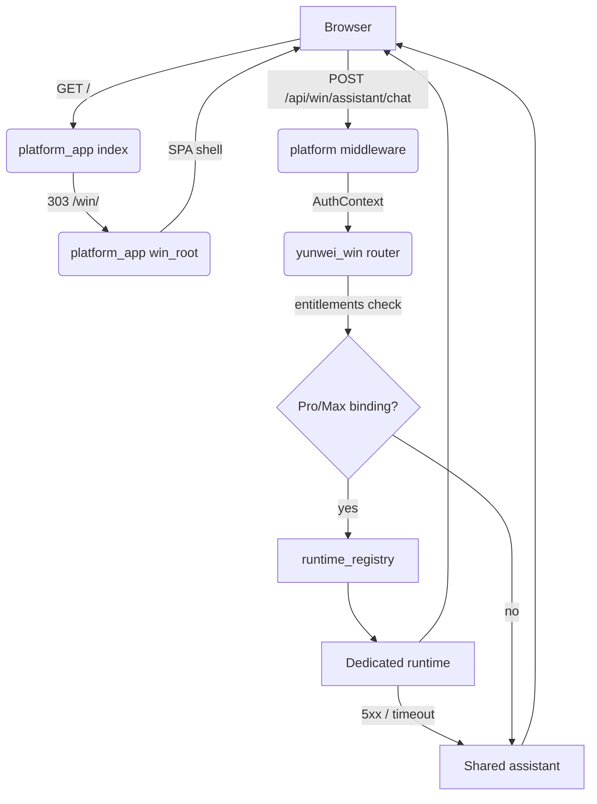

# Platform v3 — architecture

Platform v3 is the post-restructure topology: one platform control plane,
one customer-facing product backend (`yunwei_win`, branded 智通客户), a
shared Free/Lite assistant, and optional per-tenant dedicated runtimes
bound through the runtime registry. The legacy `/<client>/<agent>/` chat
dashboard scaffold and its HMAC reverse proxy have been deleted; the
customer path is now `/` → `/win/` with a single canonical browser API
surface under `/api/*`.

## Components

### `platform_app` — control plane

FastAPI app at `services/platform-api/platform_app/`. Owns everything that is
tenant-agnostic or cross-tenant:

- **Auth / session** (`auth.py`, `csrf.py`) — cookie sessions, CSRF
  double-submit, password hashing.
- **Auth context** (`context.py`) — resolves the
  `(user_id, enterprise_id, plan)` triple from the session cookie and
  attaches it to `request.state` for every `/api/win/*` call.
- **Entitlements** (`entitlements.py`) — plan-tier checks
  (`can_use_shared_assistant`, `can_use_dedicated_runtime`, etc.).
- **Platform admin API** (`admin_api.py`) — `/api/admin/*`, cross-tenant
  ops (enterprises, users, agent grants).
- **Enterprise API** (`enterprise_api.py`) — `/api/enterprise/*`, the
  current caller's enterprise + member operations. Pure API; no page
  routes.
- **Runtime registry** (`runtime_registry.py`) — maps
  `(enterprise_id, capability)` → runtime endpoint.
- **Daily report scheduler + pushers** (`daily_report/`).
- **Platform metadata DB** (`db.py`) — users, enterprises, sessions,
  invite codes, runtimes, runtime_bindings, daily_report state. One
  Postgres database shared across all tenants.

### `yunwei_win` — product backend (智通客户)

Lives at `services/platform-api/yunwei_win/`, mounted at `/api/win/*`. Owns the
customer-facing product surface:

- **Customer profile** (`api/customers.py`, `models/customer.py`).
- **Ingestion** (`api/ingest.py`, `services/ingest/`, `workers/`) —
  upload pipeline + async RQ worker (`yunwei-win-ingest-worker`
  console script).
- **Shared assistant** (`assistant/service.py`) — Free/Lite QA path,
  invoked when no dedicated runtime binding exists.
- **Customer memory** (`models/customer_memory.py` and friends).
- **Per-tenant business DB** — one Postgres database per
  `enterprise_id`, lazily provisioned by `yunwei_win/db.py`.

### Shared assistant (Free / Lite)

`yunwei_win.assistant.service.answer_shared_assistant`. Reads only the
caller's enterprise database. No external runtime container.

### Dedicated runtime (Pro / Max)

Per-tenant container that exposes `GET /healthz` and `POST /assistant/chat`.
Routed to by `yunwei_win.assistant.router` when:

1. The caller's entitlements include `can_use_dedicated_runtime`, AND
2. `runtime_registry.get_runtime_for(enterprise_id, "assistant")` returns
   a binding, AND
3. The bound runtime's `health` is not `unhealthy`.

On any 5xx / connection / timeout from the runtime, the router falls
back to the shared assistant. The runtime URL never leaves the
platform — see `runtimes/README.md`.

### Data plane

- **Platform metadata DB** — single Postgres, owned by `platform_app`.
  Contains users / sessions / enterprises / runtimes / runtime_bindings /
  daily_report state.
- **Per-tenant business DB** — one Postgres per enterprise, owned by
  `yunwei_win`. Contains customers / documents / ingest_jobs /
  customer_memory.
- **Redis** — shared. Holds session/CSRF state and the `win-ingest` RQ
  queue.
- **Object storage** — S3-compatible (Cloudflare R2 recommended) for
  staged ingest files. `STORAGE_BACKEND=s3` per
  `docs/superpowers/runbooks/win-ingest-rq-worker.md`.

## Browser-facing API contract

Every URL the browser is allowed to call lives under `/api/*` on the
same origin as the SPA. There are exactly four families:

| Prefix              | Owner                   | Purpose                                        |
| ------------------- | ----------------------- | ---------------------------------------------- |
| `/api/auth/*`       | `platform_app.api`      | `login`, `logout`, `register` (session cookie) |
| `/api/me`           | `platform_app.api`      | Current session identity                       |
| `/api/win/*`        | `yunwei_win` (mounted)  | Product API for 智通客户 SPA                   |
| `/api/admin/*`      | `platform_app.admin_api`| Platform admin (cross-tenant)                  |
| `/api/enterprise/*` | `platform_app.enterprise_api` | Current user's enterprise (pure API, no page) |

Concretely the browser sees:

- `POST /api/auth/login`
- `POST /api/auth/logout`
- `POST /api/auth/register`
- `GET  /api/me`
- `GET|POST /api/win/...` (assistant chat, customers, ingest, …)
- `GET|POST /api/admin/...` (admin-only)
- `GET|POST /api/enterprise/...` (current-user-scoped)

Page routes are intentionally tiny: `/`, `/login`, `/register`,
`/admin`, `/win/`. There is no `/<client>/<agent>/`, no `/data` page,
no `/enterprise/:id` page, no `/win/api/*`. Anything outside `/api/*`
and the named pages 404s.

## Request flow — Win assistant chat

```
Browser (logged in)
    │
    │  GET /
    ▼
platform_app.main.index
    │  app_session cookie present → 303
    ▼
GET /win/                              (same origin)
    │
    ▼
platform_app.main.win_root
    │  serves apps/win-web/dist/index.html
    ▼
SPA boots, calls
POST /api/win/assistant/chat           (same origin, X-CSRF-Token)
    │
    ▼
platform_app.main._attach_enterprise   (middleware)
    │  cookie → AuthContext (user_id, enterprise_id, plan)
    │  request.state.{auth_context, enterprise_id, user_id} = ctx
    ▼
yunwei_win.assistant.router.chat
    │
    ├── entitlements_for(ctx)
    │       can_use_shared_assistant?            no → 403
    │       can_use_dedicated_runtime?
    │
    ├── if can_use_dedicated_runtime:
    │       runtime = runtime_registry.get_runtime_for(
    │                     enterprise_id, "assistant")
    │       if runtime and runtime.health != "unhealthy":
    │           try:  ask_dedicated_runtime(runtime.endpoint_url, …)
    │                 → return runtime's {answer, citations, …}
    │           except DedicatedRuntimeError:
    │                 log + fall through to shared
    │
    └── answer_shared_assistant(session, question, customer_id=…)
            session = yunwei_win per-tenant DB
            (picked by enterprise_id on request.state)
            → {answer, citations, confidence, no_relevant_info}
```

ASCII fallback aside, the same flow as a mermaid diagram:



## Process / service layout

| Service                  | Image            | Start command                                 |
| ------------------------ | ---------------- | --------------------------------------------- |
| `platform-app` (web)     | `services/platform-api/Dockerfile` | `uvicorn platform_app.main:app …`        |
| `platform-ingest-worker` | `services/platform-api/Dockerfile` | `python -m yunwei_win.workers.ingest_rq_worker` |
| Dedicated runtimes       | per-vendor      | per-vendor; see `runtimes/README.md`           |

Local development uses `infra/local/docker-compose.yml` for the platform
web service + cloudflared. Dedicated runtimes are deliberately NOT in
the default local stack — see
`runtimes/examples/yinhu-super-xiaochen.compose.yml` for an opt-in
example.

## What changed vs v2

- `app/` (legacy chat-UI scaffold) — deleted.
- `platform/static/agents.html` (legacy customer dashboard) — archived
  to `docs/migration/archive/agents-dashboard.html`. Customer path is
  now `/` → `/win/`.
- `ops/docker-compose.yml` → `infra/local/docker-compose.yml`. The
  embedded `agent-yinhu-super-xiaochen` service moved to
  `runtimes/examples/` and is no longer started by default.
- `yinhu_brain` → `yunwei_win`. Console script renamed
  `yunwei-win-ingest-worker`.
- New: shared assistant (`yunwei_win.assistant.service`), dedicated
  runtime client (`yunwei_win.assistant.dedicated`), runtime registry
  (`platform_app.runtime_registry`), entitlements
  (`platform_app.entitlements`).
- Win product API moved from `/win/api/*` to `/api/win/*`. Auth moved
  from `/auth/login` / `/auth/logout` / `/api/register` to
  `/api/auth/login` / `/api/auth/logout` / `/api/auth/register`. The
  legacy `/<client>/<agent>/` HMAC reverse proxy (`platform_app.proxy`)
  and its `/api/agents` companion were deleted in full — see
  `docs/migration/legacy-removal.md`.
